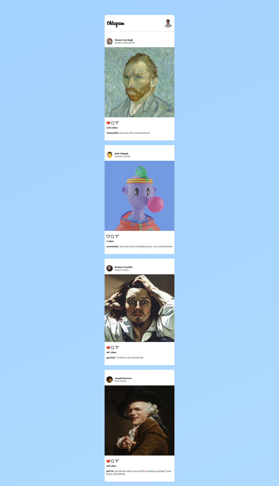

Fun features:
- likes are saved and will not be cleared on refresh
- animated gradient background
- populate posts based on a template and an array of objects
    - dynamically generate unique id attributes for those posts 
- In CSS -> `img { pointer-events: none; }`: Disable the right-click save on images, , just like Instagram

# Oldagram (Instagram Clone) solo project 

- This is my solution to a solo project in [Scrimba](https://scrimba.com).
- This webpage is a simple clone of the Instagram interface, with some added functionalities such as:
    - Like posts
    - The number of likes for the posts gets updated on click and saved to the localStorage 
    - Like button icon change on click
- My main missions for this project were as follows:
    1. Efficiently populate posts from the `posts` array of objects without extra HTML code:
        - Defined a template structure in my HTML and used it in the JavaScript code to populate the posts
        - Dynamically generated selectors with unique ids based on the number of posts. e.g. `this['likeBtn'+p.id] = document.querySelector('#like-btn-'+p.id);`
    2. Store the number of likes for the posts so they won't reset on page refresh
        - Benefited from localStorage to set key values for the number of likes and the liked state
    3. Implement a UI similar to Instagram's
        - Extra feature: Animated gradient background
- I built this project from scratch and added more functionalities than what was asked. 
- Hope you like it! Feel free to suggestion corrections and fixes to my code 🙌🏼 

## Table of contents

- [Overview](#overview)
  - [Links](#links)
  - [Demo](#demo)
  - [Screenshot](#screenshot)
- [My process](#my-process)
  - [Built with](#built-with)
  - [What I learned](#what-i-learned)
- [Author](#author)
- [Acknowledgments](#acknowledgments)

## Overview

### Links

- Solution URL: [Link](https://github.com/amir-the6th/Oldagram)
- Live Site URL: [Link](https://amir-the6th.github.io/Oldagram/)

### Demo
https://user-images.githubusercontent.com/69528025/207675731-46bcb785-2486-4eab-b4c6-82640bd3d671.mp4

### Screenshot

## My process

### Built with

- HTML5 markup
- Pure CSS
- Vanilla JavaScript

### What I learned

The only difficult part of this challenge was adding responsiveness. 

I struggled to set the width of the columns to 100% on tablets and mobiles. 

During learning how to fix this, I learned about these definitions:
- `flex-grow`
- `flex-shrink`
- `flex-basis`
- `width: max-content`

Overall, I enjoyed my time working on this project. CSS can become quite challenging, but when learned the right way, any challenge can be tackled easily.

## Author

- Website - [Amir Sabagh](https://arsenicolos.com)
- GitHub - [@amir-the6th](https://github.com/amir-the6th)
- LinkedIn - [Amir Sabagh](https://linkedin.com/in/arsenicolos)

## Acknowledgments

I want to give a shout-out to the [Scrimba](https://scrimba.com) CEO and professor, Per Harald Borgen([@perborgen](https://github.com/perborgen)). I recently finished the [HTML and CSS](https://scrimba.com/learn/htmlandcss) course on Scrimba and am currently doing the follow-up course, [Learn JavaScript for Free](https://scrimba.com/learn/learnjavascript).
